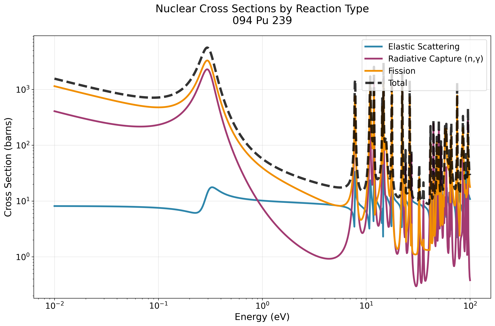
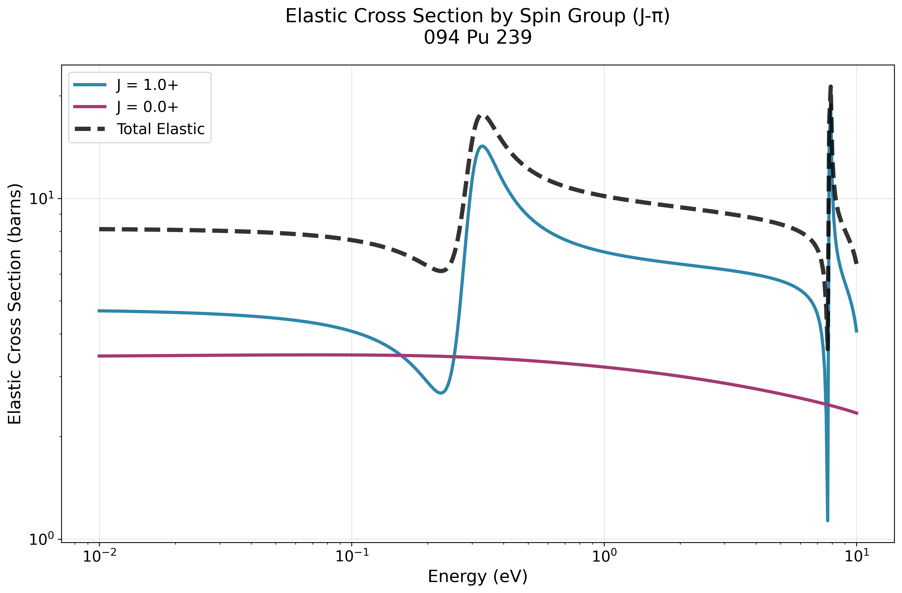
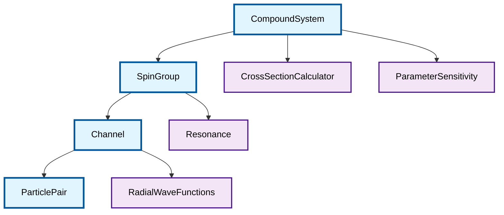
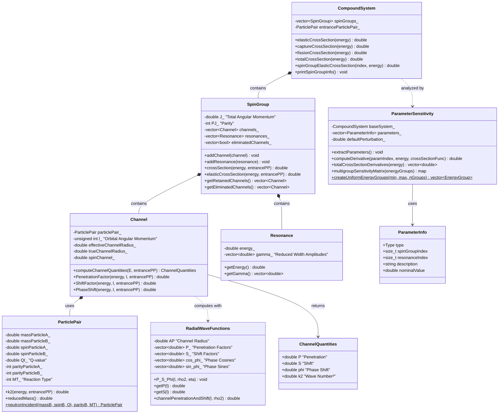

# Nuclear Data Models 🔬⚛️

**High-performance C++ library with Python bindings for nuclear data evaluation and R-Matrix calculations**


## 🎯 Showcase: Intuitive Nuclear Physics API

Experience the simplicity of C++ bindings - nuclear physics calculations become as simple as calling methods:

```python
import numpy as np
import matplotlib.pyplot as plt
from scripts.compoundFromENDFtk import create_compound_from_ReichMoore

# Eval uses RM resonance formalism but we convert it to RML formalism
compound_system = create_compound_from_ReichMoore('Pu-239.endf')

# Inspect the nuclear structure
compound_system.printSpinGroupInfo()
# → Spin Group 0/2 (0.5, 1): has 3 channels.
# → Spin Group 1/2 (1.5, 1): has 3 channels.

energies = np.logspace(-2, 2, 1000)     # 0.01 to 100 eV

elastic_xs = [compound_system.elasticCrossSection(E) for E in energies]
capture_xs = [compound_system.captureCrossSection(E) for E in energies]
fission_xs = [compound_system.fissionCrossSection(E) for E in energies]
total_xs = [compound_system.totalCrossSection(E) for E in energies]

plt.loglog(energies, elastic_xs, label='(n,n)', color=colors[0], linewidth=3)
plt.loglog(energies, capture_xs, label=r'(n,\gamma)', color=colors[1], linewidth=3)
plt.loglog(energies, fission_xs, label='(n,f)', color=colors[2], linewidth=3)
plt.loglog(energies, total_xs, label='(n,tot)', color='black', linewidth=4, linestyle='--', alpha=0.8)

plt.set_xlabel('Energy (eV)', fontsize=16)
plt.set_ylabel('Cross Section (barns)', fontsize=16)
plt.set_title(f'Nuclear Cross Sections by Reaction Type', fontsize=18, pad=20)
plt.legend(fontsize=14, loc='upper right')
plt.grid(True, alpha=0.3)

plt.tight_layout()

```



*Multiple nuclear reaction types calculated with simple calls on the compound system object.*

```python
# Individual spin group contributions (J-π physics!)
j_half_elastic = compound_system.spinGroupElasticCrossSection(0, thermal_energy)
j_3half_elastic = compound_system.spinGroupElasticCrossSection(1, thermal_energy)
print(f"J=1/2 elastic: {j_half_elastic:.1f} barns")
print(f"J=3/2 elastic: {j_3half_elastic:.1f} barns")

# Energy-dependent analysis
energies = np.logspace(-2, 2, 1000)  # 0.01 to 100 eV
elastic_xs = [compound_system.elasticCrossSection(E) for E in energies]
capture_xs = [compound_system.captureCrossSection(E) for E in energies]

# Create publication-ready plot
plt.figure(figsize=(10, 6))
plt.loglog(energies, elastic_xs, label='Elastic', linewidth=2.5)
plt.loglog(energies, capture_xs, label='Capture (n,γ)', linewidth=2.5)
plt.xlabel('Energy (eV)')
plt.ylabel('Cross Section (barns)')
plt.legend()
plt.grid(True, alpha=0.3)
plt.show()
```



*Easy spin group decomposition showing individual $J^\pi$ contributions to elastic scattering.*

## ✨ Key Features

- 🚀 **High Performance**: C++ core with Eigen3 linear algebra for fast matrix operations
- 🐍 **Python Integration**: Seamless pybind11 bindings for interactive analysis
- 📊 **Rich Visualization**: Publication-ready plots with matplotlib integration
- 🔬 **Multi-format Support**: ENDF-6 (LRF=3, LRF=7), MLBW, and R-Matrix Limited formats
- 🎛️ **Sensitivity Analysis**: Complete parameter derivative calculations for uncertainty quantification  
- ⚡ **Vectorized Operations**: Efficient energy-dependent cross section calculations
- 🧮 **Multigroup Methods**: Energy averaging for reactor physics applications
- 📈 **Resonance Analysis**: Automated peak identification and characterization
- 🔄 **Spin Group Decomposition**: Individual J-π contributions and interference effects
- 📚 **Comprehensive Documentation**: Jupyter notebooks with physics explanations

## 🏗️ Architecture Overview

Our modular design enables physicists to build complex nuclear calculations from fundamental components:



### 🧮 Core Physics Classes

### 🧮 Core Physics Classes



## 🚀 Quick Start

### Prerequisites
- **C++23** compatible compiler
- **CMake** 3.15+
- **Python** 3.8+ with development headers
- **Eigen3** (automatically fetched)
- **pybind11** (automatically fetched)

### Build & Install

```bash
# Clone and setup
git clone https://github.com/YourUsername/NuclearDataModels.git
cd NuclearDataModels

# Build the library
mkdir build && cd build
cmake -D Python3_EXECUTABLE=$(which python3) ..
make -j$(nproc)

# Test the installation
cd ../notebooks/RMatrix
python -c "import sys; sys.path.append('../../build/python'); import pyRMatrix; print('✅ Import successful!')"
```

### First Calculation

```python
import sys
sys.path.append('build/python')
import pyRMatrix
from scripts.compoundFromENDFtk import create_compound_from_ReichMoore

# Load nuclear data (Pu-239 example)
compound = create_compound_from_ReichMoore('n-094_Pu_239.endf')

# Nuclear physics at your fingertips!
energy = 1.0  # eV
print(f"Elastic:  {compound.elasticCrossSection(energy):.2f} barns")
print(f"Capture:  {compound.captureCrossSection(energy):.2f} barns") 
print(f"Fission:  {compound.fissionCrossSection(energy):.2f} barns")
print(f"Total:    {compound.totalCrossSection(energy):.2f} barns")

# Spin group decomposition (quantum mechanics made easy!)
n_groups = len([sg for sg in compound.spinGroups()])
for i in range(n_groups):
    J = compound.getSpinGroup(i).getJ()
    elastic_j = compound.spinGroupElasticCrossSection(i, energy)
    print(f"J={J} elastic: {elastic_j:.2f} barns")

# Quick visualization with our plotting utilities
from scripts.plot_cross_sections import plot_all_reactions
plot_all_reactions(compound)
```

## 📊 Advanced Features

### 🎛️ Parameter Sensitivity Analysis

Compute numerical derivatives of cross sections with respect to all resonance parameters:

```python
# Initialize sensitivity analyzer
sensitivity = pyRMatrix.ParameterSensitivity(compound, perturbation=1e-6)

# Analyze sensitivity at thermal energy
energy = 0.0253  # eV (thermal)
derivatives = sensitivity.totalCrossSectionDerivatives(energy)

# Multigroup sensitivity matrix
energy_groups = sensitivity.createLogarithmicEnergyGroups(0.01, 100, 10)
sensitivity_matrix = sensitivity.computeMultigroupSensitivityMatrix(energy_groups)

print(f"Computed {len(derivatives)} parameter sensitivities")
print(f"Most sensitive parameter: {max(derivatives):.2e}")
```

### 🔬 Interactive Jupyter Notebooks

Explore the full capabilities with our comprehensive notebook examples:

#### [`resonan_from_endfTK_LRF7.ipynb`](notebooks/RMatrix/resonan_from_endfTK_LRF7.ipynb) - Main Demonstration
- 📈 **Cross Section Visualization**: Publication-ready plots of elastic, capture, and fission cross sections
- 🔍 **Spin Group Analysis**: Individual J-π group contributions and interference effects  
- 📊 **Parameter Sensitivity**: Numerical derivatives and uncertainty quantification
- ⚡ **Performance Comparison**: Benchmark different computational approaches
- 🎯 **Resonance Identification**: Automated peak finding and resonance characterization

#### [`sensitivity.ipynb`](notebooks/RMatrix/sensitivity.ipynb) - Advanced Analysis
- 🧮 **Multigroup Calculations**: Energy-averaged cross sections for reactor physics
- 📉 **Sensitivity Matrices**: Complete parameter correlation analysis
- 🎚️ **Perturbation Studies**: Understanding parameter impact on observables

## 🧪 Example Calculations

### Resonance Analysis & Spin Group Physics
```python
# Examine nuclear structure
compound.printSpinGroupInfo()
# -> Spin Group 0/2 (0.5, 1): has 3 channels.
# -> Spin Group 1/2 (1.5, 1): has 3 channels.

# Calculate at thermal and resonance energies
thermal_energy = 0.0253   # eV (room temperature)

print("At thermal energy:")
print(f"  Total: {compound.totalCrossSection(thermal_energy):.0f} barns")
print(f"  J=1/2: {compound.spinGroupTotalCrossSection(0, thermal_energy):.0f} barns")
print(f"  J=3/2: {compound.spinGroupTotalCrossSection(1, thermal_energy):.0f} barns")
```

### Individual Channel Analysis
```python
# Access spin group details
spin_group_0 = compound.getSpinGroup(0)  # J=1/2 group
print(f"J={spin_group_0.getJ()}, Parity={spin_group_0.getPJ()}")
print(f"Number of channels: {len(spin_group_0.channels())}")
print(f"Number of resonances: {len(spin_group_0.getResonances())}")

# Compare spin group contributions across energy range
energies_thermal = np.logspace(-2, 1, 100)  # 0.01 to 10 eV
j_half_elastic = [compound.spinGroupElasticCrossSection(0, E) for E in energies_thermal]
j_3half_elastic = [compound.spinGroupElasticCrossSection(1, E) for E in energies_thermal]

# Plot spin group interference
import matplotlib.pyplot as plt
plt.figure(figsize=(10, 6))
plt.loglog(energies_thermal, j_half_elastic, label='J=1/2', linewidth=2)
plt.loglog(energies_thermal, j_3half_elastic, label='J=3/2', linewidth=2)
plt.xlabel('Energy (eV)')
plt.ylabel('Elastic Cross Section (barns)')
plt.title('Quantum Mechanical Spin Group Contributions')
plt.legend()
plt.grid(True, alpha=0.3)
plt.show()
```

### Key References
- 📖 **SAMMY Manual** - Oak Ridge National Laboratory
- 📖 **G. Ferran's Thesis** - Advanced R-Matrix implementations
- 📖 **JEFF Report 18** - JEFDOC Nuclear data evaluation guidelines
- 📖 **ENDF Manual** - International nuclear data format standards
- 📖 **Neutron Interaction Theory** - A. Foderaro

## 🏗️ Project Structure

```
NuclearDataModels/
├── 📁 include/RMatrix/          # C++ header files
│   ├── CompoundSystem.h         # Main calculation engine
│   ├── SpinGroup.h             # Quantum number groupings
│   ├── Channel.h               # Reaction channels
│   ├── ParticlePair.h          # Particle definitions
│   ├── RadialWaveFunctions.h   # Quantum wave functions
│   └── ParameterSensitivity.h  # Uncertainty quantification
├── 📁 src/RMatrix/             # C++ implementation
├── 📁 bindings/python/         # Pybind11 interfaces  
├── 📁 notebooks/RMatrix/       # Jupyter examples
│   ├── resonan_from_endfTK_LRF7.ipynb  # Main demo
│   ├── resonance_from_tk.ipynb         # Import examples
│   └── sensitivity.ipynb               # Sensitivity analysis
├── 📁 scripts/                 # Python utilities
│   ├── compoundFromENDFtk.py   # ENDF file parsers
│   └── plot_cross_sections.py # Visualization tools
└── 📁 build/                   # CMake build output
    └── python/pyRMatrix.so     # Compiled Python module
```

## 🤝 Contributing

We welcome contributions from the nuclear physics community! Please see our [Contributing Guidelines](CONTRIBUTING.md) for:

- 🐛 Bug reports and feature requests
- 🔬 Physics model improvements  
- 📊 Visualization enhancements
- 📖 Documentation and examples
- 🧪 Test cases and benchmarks

## 📄 License

This project is licensed under the [LICENSE](LICENSE) - see the file for details.

## 🙏 Acknowledgments

Built upon decades of nuclear physics research and computational methods development.

---

<div align="center">

**⚛️ Advancing Nuclear Science Through Computational Excellence ⚛️**

[](https://github.com/YourUsername/NuclearDataModels)
[](https://your-docs-url.com)

</div>
