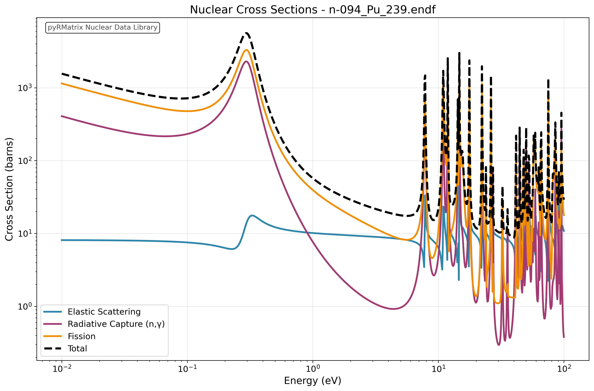
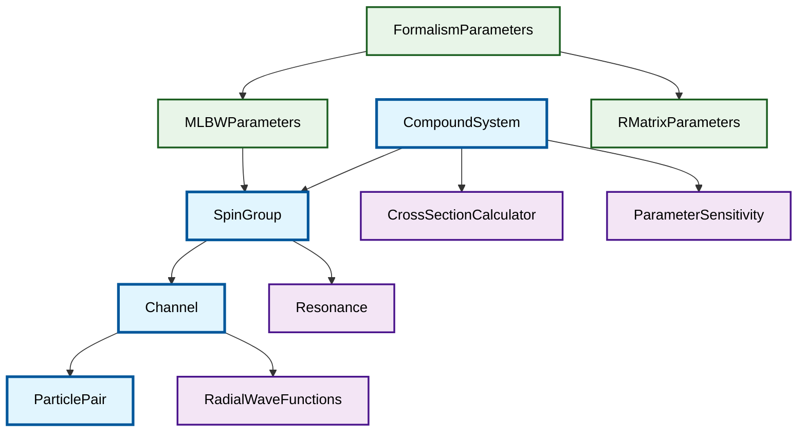

# Nuclear Data Models 🔬⚛️

**High-performance C++ library with Python bindings for nuclear data evaluation and R-Matrix calculations**


## 🎯 Showcase: Elastic Cross Section Analysis

Visualize nuclear cross sections with publication-ready plots in just 2 lines of Python:

```python
compound_system = create_compound_from_ReichMoore('Pu-239.endf')
plot_elastic_comparison(compound_system)
```



*Individual spin group contributions to elastic scattering in ²³⁹Pu, demonstrating resonance structures and quantum mechanical interference effects.*

## ✨ Key Features

- 🚀 **High Performance**: C++ core with Eigen3 linear algebra for fast matrix operations
- 🐍 **Python Integration**: Seamless pybind11 bindings for interactive analysis
- 📊 **Rich Visualization**: Publication-ready plots with matplotlib integration
- 🔬 **Multi-format Support**: ENDF-6 (LRF=3, LRF=7), MLBW, and R-Matrix Limited formats
- 🎛️ **Sensitivity Analysis**: Complete parameter derivative calculations for uncertainty quantification  
- ⚡ **Vectorized Operations**: Efficient energy-dependent cross section calculations
- 🧮 **Multigroup Methods**: Energy averaging for reactor physics applications
- 📈 **Resonance Analysis**: Automated peak identification and characterization
- 🔄 **Spin Group Decomposition**: Individual J-π contributions and interference effects
- 📚 **Comprehensive Documentation**: Jupyter notebooks with physics explanations

## 🏗️ Architecture Overview

Our modular design enables physicists to build complex nuclear calculations from fundamental components:



### 🧮 Core Physics Classes

### 🧮 Core Physics Classes


## 🚀 Quick Start

### Prerequisites
- **C++23** compatible compiler
- **CMake** 3.15+
- **Python** 3.8+ with development headers
- **Eigen3** (automatically fetched)
- **pybind11** (automatically fetched)

### Build & Install

```bash
# Clone and setup
git clone https://github.com/YourUsername/NuclearDataModels.git
cd NuclearDataModels

# Build the library
mkdir build && cd build
cmake -D Python3_EXECUTABLE=$(which python3) ..
make -j$(nproc)

# Test the installation
cd ../notebooks/RMatrix
python -c "import sys; sys.path.append('../../build/python'); import pyRMatrix; print('✅ Import successful!')"
```

### First Calculation

```python
import sys
sys.path.append('build/python')
import pyRMatrix
from scripts.compoundFromENDFtk import create_compound_from_ReichMoore

# Load nuclear data (Pu-239 example)
compound = create_compound_from_ReichMoore('n-094_Pu_239.endf')

# Calculate cross sections
energy = 1.0  # eV
print(f"Elastic:  {compound.elasticCrossSection(energy):.2f} barns")
print(f"Capture:  {compound.captureCrossSection(energy):.2f} barns") 
print(f"Fission:  {compound.fissionCrossSection(energy):.2f} barns")
print(f"Total:    {compound.totalCrossSection(energy):.2f} barns")

# Quick visualization
from scripts.plot_cross_sections import plot_all_reactions
plot_all_reactions(compound)
```

## 📊 Advanced Features

### 🎛️ Parameter Sensitivity Analysis

Compute numerical derivatives of cross sections with respect to all resonance parameters:

```python
# Initialize sensitivity analyzer
sensitivity = pyRMatrix.ParameterSensitivity(compound, perturbation=1e-6)

# Analyze sensitivity at thermal energy
energy = 0.0253  # eV (thermal)
derivatives = sensitivity.totalCrossSectionDerivatives(energy)

# Multigroup sensitivity matrix
energy_groups = sensitivity.createLogarithmicEnergyGroups(0.01, 100, 10)
sensitivity_matrix = sensitivity.computeMultigroupSensitivityMatrix(energy_groups)

print(f"Computed {len(derivatives)} parameter sensitivities")
print(f"Most sensitive parameter: {max(derivatives):.2e}")
```

### 🔬 Interactive Jupyter Notebooks

Explore the full capabilities with our comprehensive notebook examples:

#### [`resonan_from_endfTK_LRF7.ipynb`](notebooks/RMatrix/resonan_from_endfTK_LRF7.ipynb) - Main Demonstration
- 📈 **Cross Section Visualization**: Publication-ready plots of elastic, capture, and fission cross sections
- 🔍 **Spin Group Analysis**: Individual J-π group contributions and interference effects  
- 📊 **Parameter Sensitivity**: Numerical derivatives and uncertainty quantification
- ⚡ **Performance Comparison**: Benchmark different computational approaches
- 🎯 **Resonance Identification**: Automated peak finding and resonance characterization

#### [`sensitivity.ipynb`](notebooks/RMatrix/sensitivity.ipynb) - Advanced Analysis
- 🧮 **Multigroup Calculations**: Energy-averaged cross sections for reactor physics
- 📉 **Sensitivity Matrices**: Complete parameter correlation analysis
- 🎚️ **Perturbation Studies**: Understanding parameter impact on observables

#### Key Notebook Features:
```python
# One-liner nuclear data analysis
compound_system = create_compound_from_ReichMoore('Pu-239.endf')
plot_elastic_comparison(compound_system)  # → Beautiful publication plot!

# Advanced spin group breakdown  
plot_spin_group_breakdown(compound_system, 'fission')

# Parameter sensitivity heatmaps
sensitivity.computeMultigroupSensitivityMatrix(energy_groups)
```

### 🔄 Multi-format Input Support

```python
# Reich-Moore format (LRF=3)
compound_rm = create_compound_from_ReichMoore('plutonium.endf')

# R-Matrix Limited format (LRF=7) 
compound_rml = create_compound_from_RMatrix('copper.endf')

# MLBW format support
wrapper = pyRMatrix.FormalismParametersWrapper()
wrapper.fill(endf_data_dict)
mlbw = pyRMatrix.MLBW(wrapper.data.parameters.mlbw)
```

### 📈 Publication-Ready Plotting

```python
from scripts.plot_cross_sections import *

# Individual spin group contributions
plot_spin_group_breakdown(compound, 'elastic')

# Compare all reaction types
plot_all_reactions(compound)

# Customizable energy ranges and styling
plot_elastic_comparison(compound, energy_range=(-3, 3), save_path='figure.png')
```

## 🧪 Example Calculations

### Resonance Analysis
```python
# Examine individual resonances
compound.printSpinGroupInfo()

# Calculate at resonance energy
resonance_energy = 0.296  # eV (Pu-239 resonance)
xs_at_resonance = compound.totalCrossSection(resonance_energy)
print(f"Cross section at resonance: {xs_at_resonance:.0f} barns")
```

### Energy-dependent Cross Sections
```python
import numpy as np

# Thermal to fast neutron range
energies = np.logspace(-3, 6, 1000)  # 1 meV to 1 MeV
cross_sections = [compound.totalCrossSection(E) for E in energies]

# Find resonance peaks
peaks = np.where(np.array(cross_sections) > 1000)[0]
print(f"Found {len(peaks)} resonance peaks above 1000 barns")
```

## 🎓 Physical Background

This library implements modern nuclear data evaluation methods based on:

- **R-Matrix Theory**: Describes nuclear reactions through scattering matrix formalism
- **Multi-Level Breit-Wigner (MLBW)**: Resonance parameterization for isolated resonances  
- **Reich-Moore**: Advanced formalism handling overlapping resonances
- **Radial Wave Functions**: Quantum mechanical boundary conditions at nuclear surface

### Key References
- 📖 **SAMMY Manual** - Oak Ridge National Laboratory
- 📖 **G. Ferran's Thesis** - Advanced R-Matrix implementations
- 📖 **JEFF Report 18** - European nuclear data evaluation guidelines
- 📖 **ENDF Manual** - International nuclear data format standards
- 📖 **Neutron Interaction Theory** - A. Foderaro

## 🏗️ Project Structure

```
NuclearDataModels/
├── 📁 include/RMatrix/          # C++ header files
│   ├── CompoundSystem.h         # Main calculation engine
│   ├── SpinGroup.h             # Quantum number groupings
│   ├── Channel.h               # Reaction channels
│   ├── ParticlePair.h          # Particle definitions
│   ├── RadialWaveFunctions.h   # Quantum wave functions
│   └── ParameterSensitivity.h  # Uncertainty quantification
├── 📁 src/RMatrix/             # C++ implementation
├── 📁 bindings/python/         # Pybind11 interfaces  
├── 📁 notebooks/RMatrix/       # Jupyter examples
│   ├── resonan_from_endfTK_LRF7.ipynb  # Main demo
│   ├── resonance_from_tk.ipynb         # Import examples
│   └── sensitivity.ipynb               # Sensitivity analysis
├── 📁 scripts/                 # Python utilities
│   ├── compoundFromENDFtk.py   # ENDF file parsers
│   └── plot_cross_sections.py # Visualization tools
└── 📁 build/                   # CMake build output
    └── python/pyRMatrix.so     # Compiled Python module
```

## 🤝 Contributing

We welcome contributions from the nuclear physics community! Please see our [Contributing Guidelines](CONTRIBUTING.md) for:

- 🐛 Bug reports and feature requests
- 🔬 Physics model improvements  
- 📊 Visualization enhancements
- 📖 Documentation and examples
- 🧪 Test cases and benchmarks

## 📄 License

This project is licensed under the [LICENSE](LICENSE) - see the file for details.

## 🙏 Acknowledgments

Built upon decades of nuclear physics research and computational methods development. Special thanks to the nuclear data evaluation communities at ORNL, CEA, and IAEA for their foundational work in R-Matrix theory and implementation.

---

<div align="center">

**⚛️ Advancing Nuclear Science Through Computational Excellence ⚛️**

[](https://github.com/YourUsername/NuclearDataModels)
[](https://your-docs-url.com)

</div>
