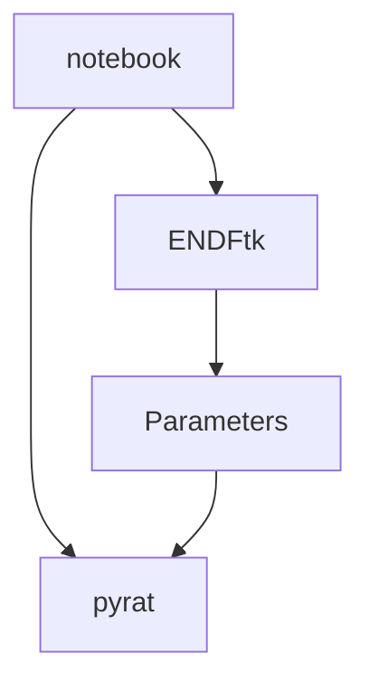
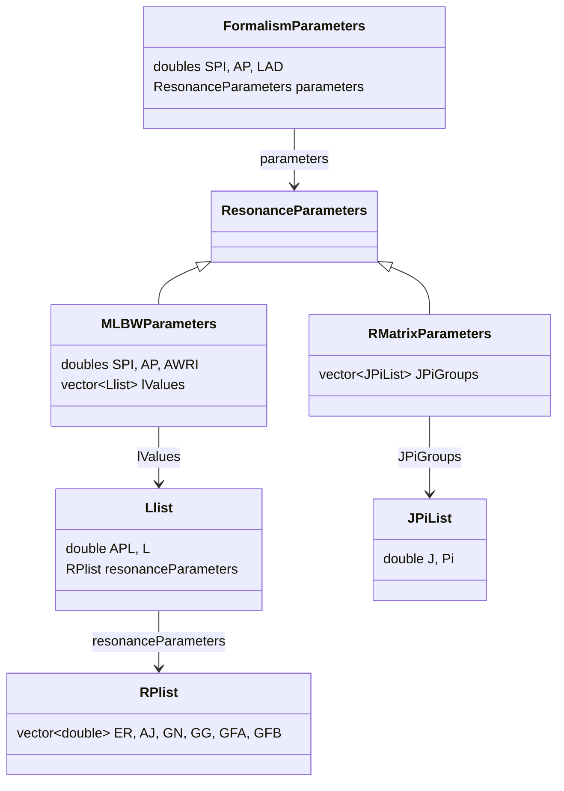
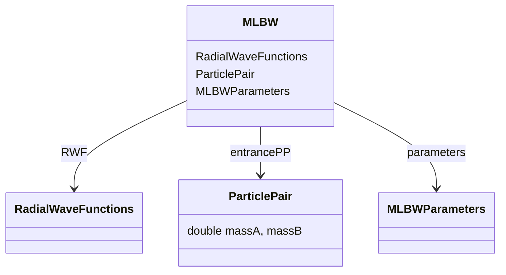

# nemo
Neutron Evaluation Models
=======
# PYRAT Project

Start with plots and demonstrating the fun we can have being a pyrat.

## Why ?

This project is a modern Resonance Analysis Tool, developped as self-teaching neutron interaction theory. Initially developped to adding fun in reading "Neutron Interaction Theory - A.Foderaro".

Efficient implementation of physics formula were inspired from reading :
- SAMMY Manual
- G.Ferran's thesis
- C.Jeannesson's thesis (future devlopment)
- JEFF Report 18 
- ENDF Manual

## Project Structure

- `cpp/`: Contains the C++ code and Pybind11 setup for efficient reconstruction.
- `python/`: Contains python script to levergae ENDFtk parser.
- `notebooks/`: Jupyter notebooks for testing and exploring functionalities.

## Setup

### Build Pyrat Extension

Navigate to the main directory and build the extension:

```sh
mkdir build; cd build;
cmake ..
make
```

### Notebook "import pyrat"



## FormalismParametersWrapper Class Diagram




## MLBW Class Diagram




## Notes 

I will stop RML implementation.
>>>>>>> First commit
